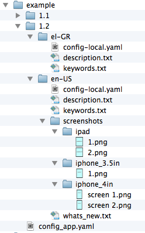

#itunes_file_system (itunesfs)
**Script for generating an iTunes Connect package (.itmsp) straight from the file system**

The task of uploading and managing the localised assets for your iOS app in a tedious one. When the number of supported languages increases, the effort needed via the web interface <https://itunesconnect.apple.com> is increased accordingly. Apple's **iTunes Transporter** CLI gives you the ability to upload App Store Packages (.itmsp) from the command line. However, altering the data requires an XML file manipulation. 

An easier way is to **use itunes_transporter_generator (itmsp)** (<https://github.com/colinhumber/itunes_transporter_generator>), which requires editing a **YAML** file and exports the final **.itmsp package**. However, when multiple localized assets are involved, this leads to a huge unmanageable YAML file.

**itunes_file_system (itunesfs)** requires that you just organise your assets (screenshots, decription, keywords )in a spesific file hierarchy. Running *itunesfs* produces an intermediate YAML configuration file. If you also have *itmsp* installed, *itunesfs* can use it to generate the final .itmsp package that can be uploaded at iTunes Connect.

Essentially, **itunesfs**, by itself, performs the following coversion:

 **------>** 

##Installation

1. Download and install **python 3** <http://www.python.org/download/>. Python 2.x is not supported at the moment.
* If you have **PIP** installed for Python 3 (<http://pip.readthedocs.org/en/latest/installing.html>) type:

		$ sudo pip3 install itunesfs  
Otherwise download the source and type:

		$ sudo python3 setup.py install  

* *(optional)* Install itunes_transporter_generator <https://github.com/colinhumber/itunes_transporter_generator>. Run:

		$ gem install itunes_transporter_generator
		
##Usage

###Organise your folders

Your files have to be organized as shown in the "example" app, which is included in the package. Note that all files should be encoded using **UTF-8**.

 

* At the root folder, the **config_app.yaml** contains the basic configuration for the app. 
* One or more **versions** can exist as folders under the root folder. 
* Each version can have one or more **locales**. The "master" locale, that should always be available, is "en-US". 
* Each locale can have:
    * the **config-local.yaml**, that contains locale related configuration such as the title of the app
    * the **description.txt**, that holds the App Store description
    * the **keywords.txt**, that is a comma separated list of the keywords. The spaces around each keyword, will be erased. Also a warning will be produced when they exceed the App Store 100 character limit.
    * a **screenshot** folder. It can contain ipad, iphone_3.5in or iphone_4in subfolders. Each device subfolder can have one or more screenshot files. The order that they will be used is alphabetical.

The "en-US" locale must always contain the following files: **config-local.yaml**, **description.txt**, **keywords.txt**. Even though screenshots are optional, itmsp will faild to produce the .itmsp without them.

For the other locales, these files are **optional**. If a file is not found, the corresponding "en-US" file will be used instead.

###Generate the .itmsp

If your python's bin folder is in yout PATH, then **itunesfs** can be executed from the command line.

####To create the YAML configuration file
		itunesfs <path_to_asset_folder>
		
This creates an *output.yaml* file under the root of the input folder. If you want to change the output directory use:

		itunesfs <path_to_asset_folder> -o <output_path>
This will also copy the screenshot files.

####To create the .itmsp package

If you have installed *itmsp*, change to the directory where *output.yaml* is. Make any further chagnes and run:

		itmsp package -i output.yaml